# IA-Project

# 1 Introduction

This project is the final project for the Information Architectures course in Yeshiva University's Data Analytics and Visualization Graduate program. 
Team members are Jiaqi Min, Alan Leidner, Yuehao Wang, Ke Chen, and Marla Goodman

* Problem: The general problem we are trying to solve is how can we analyze and understand the effect of outside variables on 311 complaints. 
* Solution: Build a warehouse that updates automatically, and where it is easy to integrate other resources into, with frontend dashboard. As a proof of concept we will analyze the effect of covid and income levels on a subset of 311 complaints, noise complaints.

In this Github, there will be files scripts that created our database and datawarehouse in MySQL workbench from the 311 data. 

There will be charts and a Juptyer Notebook that examines the data for any statistical significance.

There will also be a Tableau Notebook that connects directly to the AWS architectrue.

## Architecture Diagram
  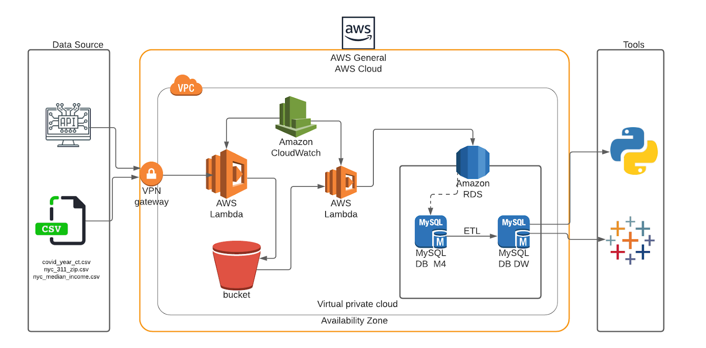

## Data Sources
  NYC311 requests: https://data.cityofnewyork.us/Social-Services/311-Service-Requests-from-2010-to-Present/erm2-nwe9]
    - Frequence: Daily
    - Rows:1.3M (Original 25M)
    - Columns:16
    - Data Type: API, CSV
    - Granularity: a 311 complaint

  NYC Covid19: https://github.com/nychealth/coronavirus-data
    - Frequence: Daily
    - Rows: 6764
    - Columns:3
    - Data Type: API, CSV
    - Granularity: caserate grouping by Zip Code

  [NYC Median Income|https://data.cccnewyork.org/data/table/66/median-incomes#66/107/62/a/a]
    - Frequence: 2019
    - Rows: 181
    - Columns:3
    - Data Type: CSV
    - Granularity: Grouping by Zip Code

 
# 2 Deploy AWS
## 2.1 Create S3 and upload history data into S3

- 2.1.1 In AWS create a bucket named it. For example, bucket name: information-arch-yuehao-wang-assignment-8a

- 2.1.2 Upload 4 files that are in the /AWS/data/ into the above bucket.
  covid19_borough_caserate.csv
  covid19_zipcode_caserate.csv
  nyc_median_income_zipcode.csv
  311_Service_Requests_from_2019_to_Present.csv (It is over 1.4GB. The Github does not allowed to upload it. We can use the S3 file)

## 2.2 Create RDS and create databases(schemas)
- 2.2.1 Create a new Mysql 8.0 instance in RDS and give a name. For example, ia_final
- 2.2.2 Use Mysql Workbench to connect to the new RDS instance
  - create a schema for original data. Name is m4. It stories original data from different data sources.
    - run /AWS/sql/m4_t_311_items.sql

  - create a schema for data warehouse. Name is 311_dw. It stories the Star-Model data warhouse.
    - run /AWS/sql/311_dw_ddl.sql
    - run /AWS/sql/311dw_init_date_temp_proc.sql
    - run /AWS/sql/311dw_updateDimensionsProc.sql
   
   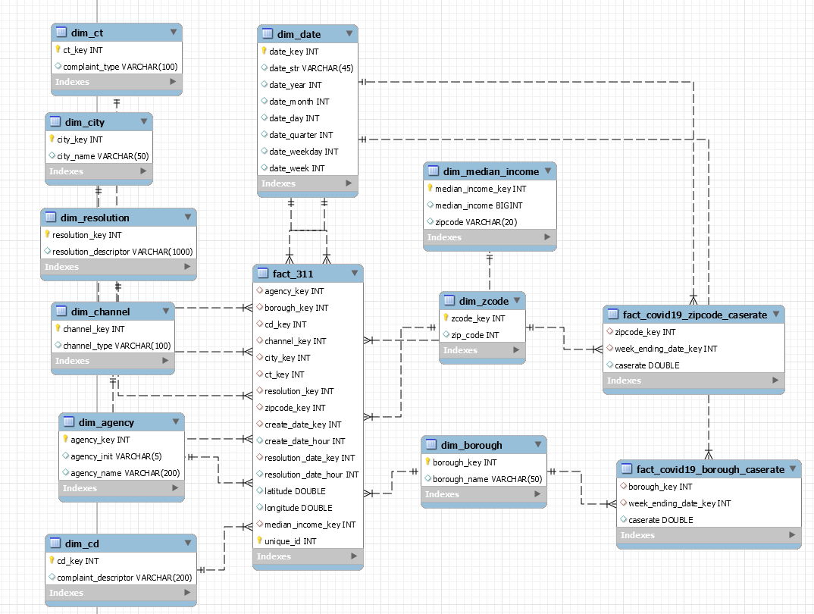
   
  - upload history data
    - history data of NYC median income. Open \AWS\script\jupyter311data_nyc_median_income_zipcode.ipynb. Modify file path to you local path, S3 paht or Github path. Run it.
    - history data of NYC 311. Open \AWS\script\311data_history_to_rds.ipynb. Modify file path to you local path, S3 paht or Github path. Run it.
   
   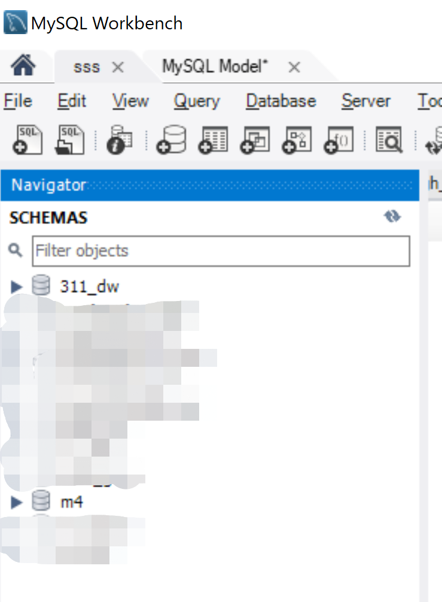

## 2.3 Create lambda functions
- 2.3.1 zip all python scripts in /AWS/script without the /AWS/script/jupter. Name is function.zip

- 2.3.2 create a layer. 
  - Name is pandas-mysql-request
  - upload the \AWS\sources\panda_layer.zip

- 2.3.3 create 5 functions
  - 1) 311data_daily_save_to_s3
    - upload the function.zip
    - add a layer for it and select pandas-mysql-request
  - 2) 311data_covid19_cases_to_s3_daily
    - upload the function.zip
    - add a layer for it and select pandas-mysql-request
  - 3) 311data_daily_data_to_rds
    - upload the function.zip
    - add VPC. The VPC is small with instance of RDS
  - 4) 311data_covid19_cases_to_rds_daily
    - upload the function.zip
    - add VPC. The VPC is small with instance of RDS
  - 5) 311_daily_dw_update_stored_procedure. It will call storied proceduce to finish the Level-1 data warehouse.
    - upload the function.zip
    - add VPC. The VPC is small with instance of RDS
  
  

## 2.4 Schedule the lambda functions
  - Open EventBridge (CloudWatch Events)
  - create a rule. Runing time is 3：00am/per day. Select the Lambda function (311data_daily_save_to_s3) as target.
  - create a rule. Runing time is 3:15am/per day. Select the Lambda function (311data_covid19_cases_to_s3_daily_rule) as target.
  - create a rule. Runing time is 3:30am/per day. Select the Lambda function (311data_daily_data_to_rds_rule) as target.
  - create a rule. Runing time is 3:45am/per day. Select the Lambda function (311data_covid19_cases_to_rds_daily_rule) as target.
  - create a rule. Runing time is 4：00am/per day. Select the Lambda function (311_daily_dw_update_stored_procedure_rule) as target.

    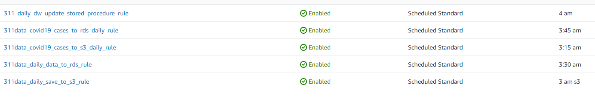
  
# 3 Create Visualization
  Downloadable Packaged Workbook: https://github.com/MarlaGoodman/IA-Project/blob/main/Info_Arch_Final.twbx
  
 There are many variables an analyst might be interested analysing in this dataset. In our tableau workbook we connected directly to the AWS architecture to leverage the daily uploads. While there are many possible relationships in our data, we created three primary visualizations as proof of concept to explore.

## 3.1 Week over Week Change in Noise Complaints
   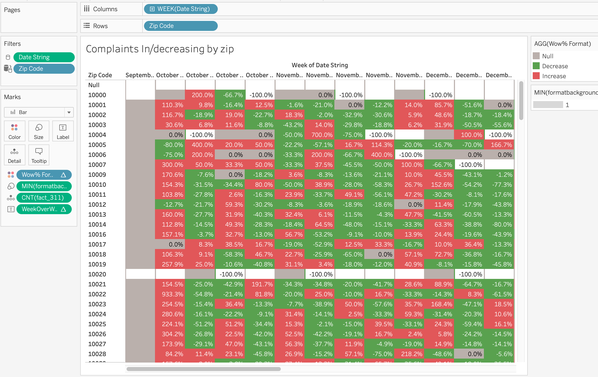
## 3.2 Map of Covid/Median Income
   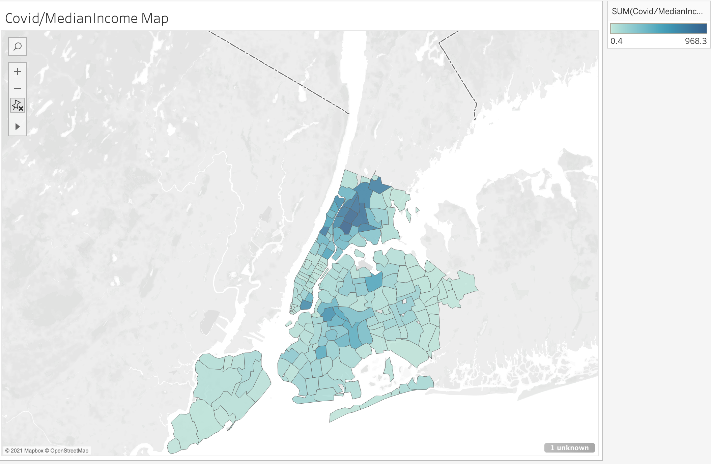
## 3.3 Dashboard to explore Noise Complaints of Individual Zipcodes
   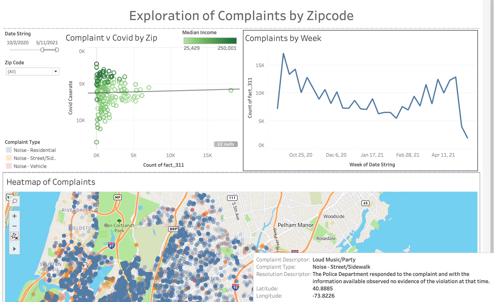

In addition to exploring variables, we wanted to know if any of them had statistically significant affects on the ammount of noise complaints.

# 4 Analyze Data 
(script here:https://github.com/MarlaGoodman/IA-Project/blob/main/IA%20Final%20Project%20Stats%20(1).ipynb)

## 4.1 Income vs. complaint frequency

- 4.1.1 Bring data into Jupyter Notebook
  - Data sources (compiled into CSV folder here)
    -import pandas library
    - read in NYC median income by zipcode data: https://github.com/MarlaGoodman/IA-Project/blob/main/CSV/nyc_median_income.csv
    - read in frequency of complaints by NYC zipcode data: https://github.com/MarlaGoodman/IA-Project/blob/main/CSV/nyc_311_zip.csv

- 4.1.2 Prepare data
  - merge data frames on zip code, rename columns

  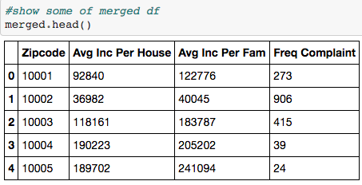
  
  - import matplotlib, seaborn, sklearn, numpy and scipy libraries
  - exploratory data anaylsis

- 4.1.3 Analyze
  - create scatterplot

  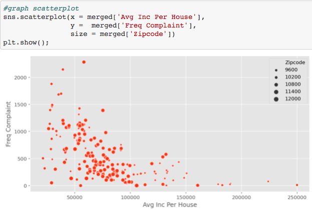 
  
  - run linear regression

  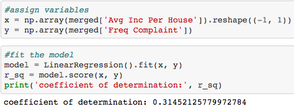
  
  - Nearly 32% (or almost a third) of all the variation in the frequency of complaints from NYC zipcodes is explained by just the one variable of medican income per zipcode.

## 4.2 Independece (pre/during covid & complaint type)

- 4.2.1 Prepare and bring data into Jupyter Notebook
  - run join statement from data warehouse in MySQL (example of joins: https://github.com/MarlaGoodman/IA-Project/blob/main/Joins.sql)
  - get result containing complaint type(s), complaint key, year 
  - export result to csv, upload to Github, run into Notebook data frame 

- 4.2.2 Analyze
  - Hypothesis test
    - state null and alternative hypotheses
    - meet chi - square test of independence conditions
    - create contingency table

    

    - use scipy to get p-value

    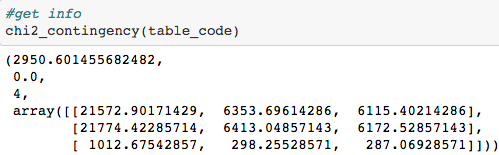

    - conclude (reject/fail to reject null hypothesis)
       - Using a significance level of .05 (95%), we see that the p-value (0) is less than the significance value. Therefore, we reject the null hypothesis and conclude that there is some association between the timing of covid (Pre or During) and the complaints received by 311 in NYC.
      
   - Can also take a look at noise complaints in another chi-square test

# 5 Lines of Work to Expand this Project in the Future
  - Incorporate new datasets to measure new variables [race, twitter sentiments etc]
  - Build a more robust architecture, possibly a columnar database to ease reporting
  - Leverage Glue and other AWS products to create a more robust architecture in instead of custom scripts. ETL and transferring is done with scripts now, instead of aws tools. 
  - Expand the dataset to NY state, or other cities

    
  
 

