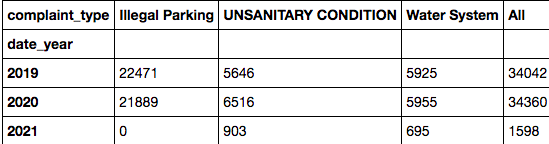

# IA-Project

# 1 Introduction

This project is the final project for the Information Architectures course in Yeshiva University's Data Analytics and Visualization Graduate program. 
Team members are Jiaqi Min, Alan Leidner, Yuehao Wang, Ke Chen, and Marla Goodman

* Problem: The general problem we are trying to solve is how can we analyze and understand the effect of outside variables on 311 complaints. 
* Solution: Build a data warehouse that updates automatically, and where it is easy to integrate other resources into, with frontend dashboard. As a proof of concept, we will analyze the effect of covid and income levels on a subset of 311 complaints, noise complaints.

In this Github, there will be files scripts that created our database and data warehouse in MySQL workbench from the 311 data. 

There will be charts and a Juptyer Notebook that examines the data for any statistical significance.

There will also be a Tableau Notebook that connects directly to the AWS architectrue.

## Architecture Diagram
  

## Data Sources
  NYC311 requests: https://data.cityofnewyork.us/Social-Services/311-Service-Requests-from-2010-to-Present/erm2-nwe9
    - Frequence: Daily
    - Rows:1.3M (Original 25M)
    - Columns:16
    - Data Format: CSV via API
    - Granularity: a 311 complaint

  NYC Covid19: https://github.com/nychealth/coronavirus-data
    - Frequence: Daily
    - Rows: 6764
    - Columns:3
    - Data Format: CSV via API
    - Granularity: caserate grouping by Zip Code

  NYC Median Income:https://data.cccnewyork.org/data/table/66/median-incomes#66/107/62/a/a
    - Frequence: 2019
    - Rows: 181
    - Columns:3
    - Data Format: CSV
    - Granularity: Grouping by Zip Code

 
# 2 Deploy AWS
## 2.1 Create S3 bucket and upload historical data into S3

- 2.1.1 In AWS, create a bucket and name it. For example, bucket name: information-arch-yuehao-wang-assignment-8a .

- 2.1.2 Upload 4 files that are in the /AWS/data/ into the bucket above.
  covid19_borough_caserate.csv
  covid19_zipcode_caserate.csv
  nyc_median_income_zipcode.csv
  311_Service_Requests_from_2019_to_Present.csv (Github does not support uploading large file sized 1.4GB. The file in S3 will be used.)

## 2.2 Create RDS and databases (schema deployment)
- 2.2.1 Create a new Mysql 8.0 instance in AWS RDS and name it ia_final .
- 2.2.2 Use Mysql Workbench to connect to the new AWS RDS instance.
  - Create a schema for original data. Name it m4 for storing original data from different data sources.
    - run /AWS/sql/m4_t_311_items.sql

  - Create a schema for data warehouse. Name it 311_dw for storing the star schema data warhouse.
    - run /AWS/sql/311_dw_ddl.sql
    - run /AWS/sql/311dw_init_date_temp_proc.sql
    - run /AWS/sql/311dw_updateDimensionsProc.sql
   
   
   
  - Upload historical data
    - historical data of NYC median income. Open \AWS\script\jupyter311data_nyc_median_income_zipcode.ipynb. Modify file path to you local path, S3 path or Github path. Run it.
    - historical data of NYC 311. Open \AWS\script\311data_history_to_rds.ipynb. Modify file path to you local path, S3 path or Github path. Run it.
   
   

## 2.3 Create AWS Lambda functions
- 2.3.1 Zip all python scripts in /AWS/script without the /AWS/script/jupter. Name it function.zip

- 2.3.2 Create a layer. 
  - Name it pandas-mysql-request
  - Upload the \AWS\sources\panda_layer.zip

- 2.3.3 Create 5 functions
  - 1) 311data_daily_save_to_s3
    - upload the function.zip
    - add a layer for it and select pandas-mysql-request
  - 2) 311data_covid19_cases_to_s3_daily
    - upload the function.zip
    - add a layer for it and select pandas-mysql-request
  - 3) 311data_daily_data_to_rds
    - upload the function.zip
    - add VPC. The VPC is same with instance of AWS RDS
  - 4) 311data_covid19_cases_to_rds_daily
    - upload the function.zip
    - add VPC. The VPC is same with instance of AWS RDS
  - 5) 311_daily_dw_update_stored_procedure. It will call storied proceduce to finish the Level-1 data warehouse.
    - upload the function.zip
    - add VPC. The VPC is same with instance of AWS RDS
  
  

## 2.4 Schedule the AWS Lambda functions
  - Open AWS EventBridge (AWS CloudWatch Events)
  - Create a rule. Runing time is 3:00am every day. Select the AWS Lambda function (311data_daily_save_to_s3) as target.
  - Create a rule. Runing time is 3:15am every day. Select the AWS Lambda function (311data_covid19_cases_to_s3_daily_rule) as target.
  - Create a rule. Runing time is 3:30am every day. Select the AWS Lambda function (311data_daily_data_to_rds_rule) as target.
  - Create a rule. Runing time is 3:45am every day. Select the AWS Lambda function (311data_covid19_cases_to_rds_daily_rule) as target.
  - Create a rule. Runing time is 4：00am every day. Select the AWS Lambda function (311_daily_dw_update_stored_procedure_rule) as target.

    
  
# 3 Create Visualization
  Downloadable Packaged Workbook: https://github.com/MarlaGoodman/IA-Project/blob/main/Info_Arch_Final.twbx
  
 There are many variables an analyst might be interested in analysing in this dataset. In our tableau workbook, we connected directly to the AWS architecture to leverage the daily uploads. While there are many possible relationships in our data, we created three primary visualizations as proof of concept to explore.

## 3.1 Week over Week Change in Noise Complaints
- This is a graph which would help analysts get an easy sense of which zip codes are recieving more complaints over time. It would allow the viewer to know where they could focus their efforts, if complaints are rising over time.
   
## 3.2 Map of Covid/Median Income
- This visualization can show at a glance which areas of New York City have a disproportionate number of covid cases, compared to median income. Based on this image, it may be worth investigating how the information has been recorded; It is suspected that hospitals in the Bronx are reporting cases from their location, instead of from the patients home address.
   
## 3.3 Dashboard to Explore Noise Complaints of Individual Zip Codes
- This dashboard can help analysts explore individual zip codes on a street level, to get a sense of what types of complaints are being reported on a ground level, and see how those complaints relate to the relative covid rates and median incomes over time.
   

In addition to exploring variables, we would like to know if any of them had statistical significant affects on the amount of noise complaints.

# 4 Analyze Data 
(script here:https://github.com/MarlaGoodman/IA-Project/blob/main/IA%20Final%20Project%20Stats%20(1).ipynb)

## 4.1 Income vs. Complaint Frequency

- 4.1.1 Bring data into Jupyter Notebook
  - Data sources (compiled into CSV folder here)
    -Import pandas library.
    - read in NYC median income by zip code data: https://github.com/MarlaGoodman/IA-Project/blob/main/CSV/nyc_median_income.csv
    - read in frequency of complaints by NYC zip code data: https://github.com/MarlaGoodman/IA-Project/blob/main/CSV/nyc_311_zip.csv

- 4.1.2 Prepare data
  - Merge data frames on zip code, rename columns.

  
  
  - Import matplotlib, seaborn, sklearn, numpy and scipy libraries.
  - Exploratory data anaylsis.

- 4.1.3 Analyze
  - Create scatterplot.

   
  
  - Run linear regression.

  
  
  - Nearly 32% (or almost a third) of all the variation in the frequency of complaints from NYC zip codes is explained by just the one variable of medican income per zip code.

## 4.2 Independece (pre/during covid & complaint type)

- 4.2.1 Prepare and bring data into Jupyter Notebook
  - Run join statement from data warehouse in MySQL workbench (example of joins: https://github.com/MarlaGoodman/IA-Project/blob/main/Joins.sql).
  - Get result containing complaint type(s), complaint key, year. 
  - Export result to CSV file, upload to Github, run into Notebook data frame.

- 4.2.2 Analyze
  - Hypothesis test.
    - state null and alternative hypotheses
    - meet chi - square test of independence conditions
    - create contingency table
    - use scipy to get p-value

    

    

    - conclude (reject/fail to reject null hypothesis)
       - Using a significance level of 0.05 (95%), we see that the p-value (0) is less than the significance value. Therefore, we reject the null hypothesis and conclude that there is some association between the timing of covid (Pre or During) and the complaints received by 311 in NYC.
      
   - Can also take a look at noise complaints in another chi-square test.

# 5 Lines of Work to Expand this Project in the Future
  - Incorporate new datasets to measure new variables [race, twitter sentiments etc].
  - Build a more robust architecture, possibly a columnar database or other NoSQL type database to ease reporting and querying.
  - Leverage AWS Glue and other AWS products to create a more robust architecture in instead of custom scripts. ETL and transferring is done with scripts now, instead of aws tools. 
  - Expand the dataset to NY State, or other cities.

    
  
 

