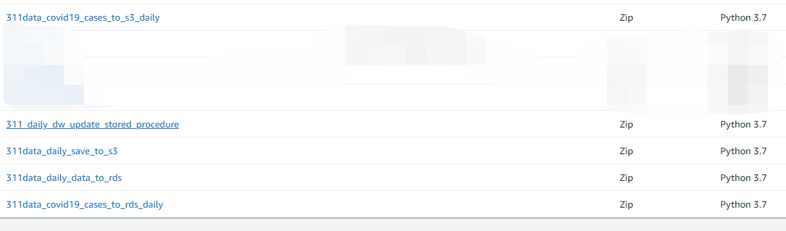
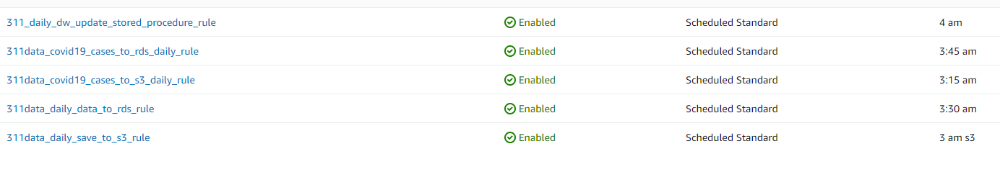

# IA-Project
This project is the final project for the Information Architectures course in Yeshiva University's Data Analytics and Visualization Graduate program. 
Team members are Jiaqi Min, Alan Leidner, Yuehao Wang, Ke Chen, and Marla Goodman

The project focuses on data from NYC 311's database. 

In this Github, there will be files scripts that created our database and datawarehouse in MySQL workbench from the 311 data. 

There will be charts and a Juptyer Notebook that examines the data for any statistical significance.

There will also be a visualiztion via Tableau. 

# 2 Deploy AWS
## 2.1 Create S3 and upload history data into S3

- 2.1.1 In AWS create a bucket named it. For example, bucket name: information-arch-yuehao-wang-assignment-8a

- 2.1.2 Upload 4 files that are in the /AWS/data/ into the above bucket.

## 2.2 Create RDS and create databases(schemas)
- 2.2.1 Create a new Mysql 8.0 instance in RDS and give a name. For example, ia_final
- 2.2.2 Use Mysql Workbench to connect to the new RDS instance
  - create a schema for original data. Name is m4. It stories original data from different data sources.
    - run /AWS/sql/m4_t_311_items.sql

  - create a schema for data warehouse. Name is 311_dw. It stories the Star-Model data warhouse.
    - run /AWS/sql/311_dw_ddl.sql
    - run /AWS/sql/311dw_init_date_temp_proc.sql
    - run /AWS/sql/311dw_updateDimensionsProc.sql

## 2.3 Create lambda functions
- 2.3.1 zip all python scripts in /AWS/script without the /AWS/script/jupter. Name is function.zip

- 2.3.2 crate a layer. 
  - Name is pandas-mysql-request
  - upload the \AWS\sources\panda_layer.zip

- 2.3.3 create 5 functions
  - 1) 311data_daily_save_to_s3
    - upload the function.zip
    - add a layer for it and select pandas-mysql-request
  - 2) 311data_covid19_cases_to_s3_daily
    - upload the function.zip
    - add a layer for it and select pandas-mysql-request
  - 3) 311data_daily_data_to_rds
    - upload the function.zip
    - add VPC. The VPC is small with instance of RDS
  - 4) 311data_covid19_cases_to_rds_daily
    - upload the function.zip
    - add VPC. The VPC is small with instance of RDS
  - 5) 311_daily_dw_update_stored_procedure. It will call storied proceduce to finish the Level-1 data warehouse.
    - upload the function.zip
    - add VPC. The VPC is small with instance of RDS
  

## 2.4 Schedule the lambda functions
  - Open EventBridge (CloudWatch Events)
  - create a rule. Runing time is 3：00am/per day. Select the Lambda function (311data_daily_save_to_s3) as target.
  - create a rule. Runing time is 3:15am/per day. Select the Lambda function (311data_covid19_cases_to_s3_daily_rule) as target.
  - create a rule. Runing time is 3:30am/per day. Select the Lambda function (311data_daily_data_to_rds_rule) as target.
  - create a rule. Runing time is 3:45am/per day. Select the Lambda function (311data_covid19_cases_to_rds_daily_rule) as target.
  - create a rule. Runing time is 4：00am/per day. Select the Lambda function (311_daily_dw_update_stored_procedure_rule) as target.

